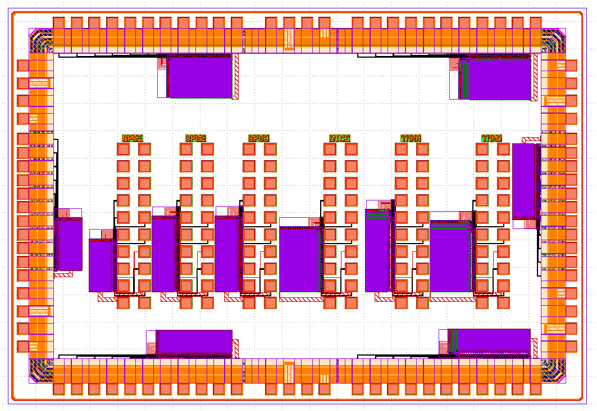
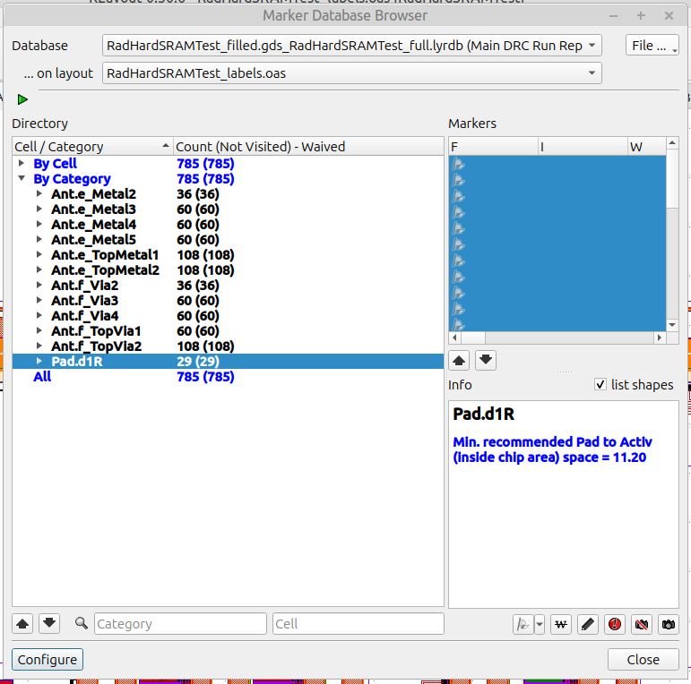
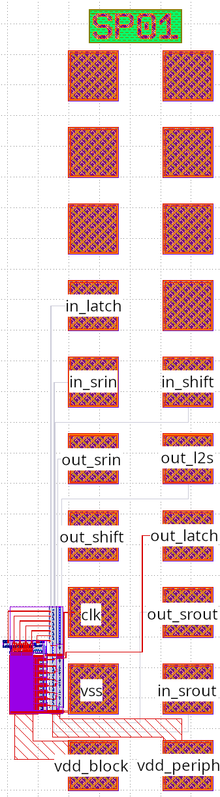
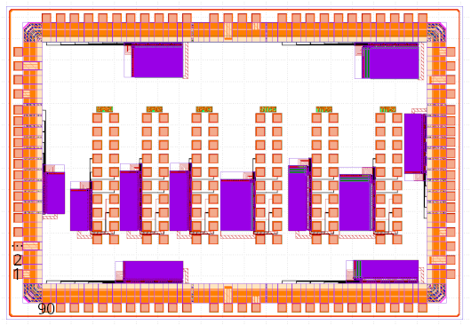

# SRAM blocks test structures with radiation hardening options

This is design of test structures to verify functionality and timing of some SRAM blocks generated by the WIP SRAM compiler with some optional radiation hardening applied. The radiation hardening applied is use of bigger SRAM cell with higher drive strength, block with a DICE latch bit cell and blocks with TMR for the row and column decoders.

## Contents

Layout of the testchip (without fillers):

The testchip consists of six SRAM blocks with shift registers on input and output that allows to test the functionality and timing of the blocks with reduced number of pins. All six blocks are single port with 512 words of 32 bits with 4 write-enable signals. Bigger blocks have been put on the chip to ease statistics and going for a heavy ion campaign. The SRAM block variations are:

* SP01: regular small bit cell
* SP02: bit cell with increased are, first variation
* SP03: bit cell with increased are, first variation
* DICE: DICE bit cell
* TMRR: bit cell with increased area, first variation and TMR on row and column decoders
* TMRD: DICE bit cell and TMR on row and column decoders

Each of the blocks is put on the testchip twice. One time connected to the padring to test the SRAM blocks on a packaged chip. One time connected out to a pad frame to test the SRAM blocks with a probe card on wafer.

For the three variations of the single bit cell the different metrics were simulated and here are the results:

| Variation | w_pu  | w_pd  | w_pg | I_read | I_leak | SNM_hold | SNM_read | WTP |
|-|-|-|-|-|-|-|-|-|
| SP01 | 0.15µm | 0.20µm | 0.20µm | 46.9µA | 18.3pA | 754.6mV | 4715mV | 225.1mV |
| SP02 | 0.55µm | 0.55µm | 0.30µm | 80.1µA | 70.1pA | 751.1mV | 543.8mV | 131.1mV |
| SP03 | 0.20µm | 0.90µm | 0.20µm | 74.6µA | 64.1pA | 714.5mV | 561.2mV | 174.7mV |

Also for DICE bit cell the metrics were simulated:

| I_read | I_leak | SNM_hold | SNM_read | WTP |
|-|-|-|-|-|
| 112.9µA | 90.0pA | 785.8mV | 541.8mV | 211.5mV |

### Provided folders and files

* `gds`: in this directory the output file `RadHardSRAMTest_filled.gds.gz` is the layout of the design. The `RadHardSRAMTest_filled_v2.gds.gz` is the actual file submitted for tape-in and should be the same as `RadHardSRAMTest_filled.gds.gz`. `RadHardSRAMTest_filled_v1.gds.gz` is an itermediate file only kept here for reference and should be ignored.
* `spice/RadHardSRAMTest_labels_nopadring.spi`: the spice netlist of the design but without the netlist of the IO cells. These are just black box cells in this netlist due to the way the layout is made.
* `drc`: `drc/RadHardSRAMTest_filled.log` is the log file of the DRC and `drc/RadHardSRAMTest_filled.gds_RadHardSRAMTest_full.lyrdb` the corresponding klayout marker database.  
  The waived DRC errors are antenna violations with a protection diode present and `Pad.d1R` which is a minimum `Pad` to `Activ` spacing. Here is the overview in klayout 'Marker Database Browser`
  
* `lvs`: a folder is present for each probe card padframe subcell to verify the LVS of that cell. Due to the missing netlist of the IO cells not LVS could be done on top level. Top level was verified manually using `Tools->Trace All Nets->Hierarchical` in klayout.

## Test periphery

The same test preriphery has been used for this design as for the previous SRAM blocks test chip. Refer to the `Test Periphery` section of the [previous testchip documentation](https://github.com/IHP-GmbH/TO_Sep2025/blob/main/FlowSpace_SRAMBlocksTest/doc/README.md).  
Reusing the test periphery and connection allows to reuse much of the measurement set-up of the previous chip.

## SRAM blocks test chip pin-outs and shift register order

### SRAM test block signals

As design is reused from previous test chip the signals fot the single port SRAM blocks is also the same:

* vss
* vdd_periph
* vdd_block
* clk
* in_srin
* in_srout
* in_shift
* in_latch
* out_srin
* out_srout
* out_shift
* out_l2s
* out_latch

And they are connected to the same shift register location as for the previous test chip.

### Probe card pad frame signals

Also the probe card pad frame has the same connections allowing to reuse measurement set-up of previous design:

### Pad ring signals

For this design a fully custom IO ring was made so enough IOs were foreseen so no signals needed to be shared between the different blocks. E.g. each block has it's own `in_srin` and `out_srin` signal where on the previous design that where there was only one global `srin` signal.

For the pin numbering we take 1 for the bottom bond pad on the left side of the pad ring and then number the pins clock-wise. In [PadRing_PinOut.ods](PadRing_PinOut.ods) you can then find the signals corresponding with each bond pad and the internal connection to the SRAM block.

**TODO: pin numbers need to be updated when package is selected for packaging**

## Measurement procedures

As design is same as previous test chip also the measurement procedures are the same. Please refer to the `measurement procedures` section of the [previous testchip documentation](https://github.com/IHP-GmbH/TO_Sep2025/blob/main/FlowSpace_SRAMBlocksTest/doc/README.md).
